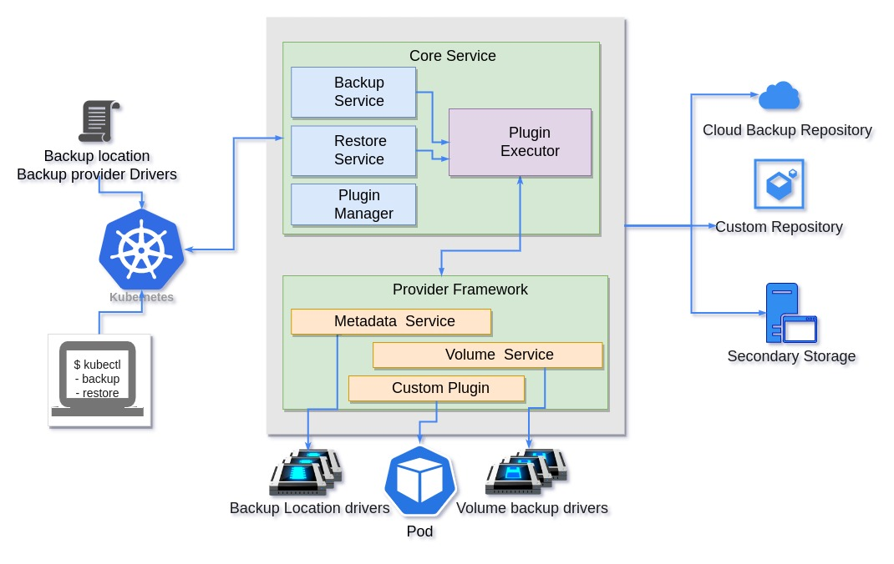
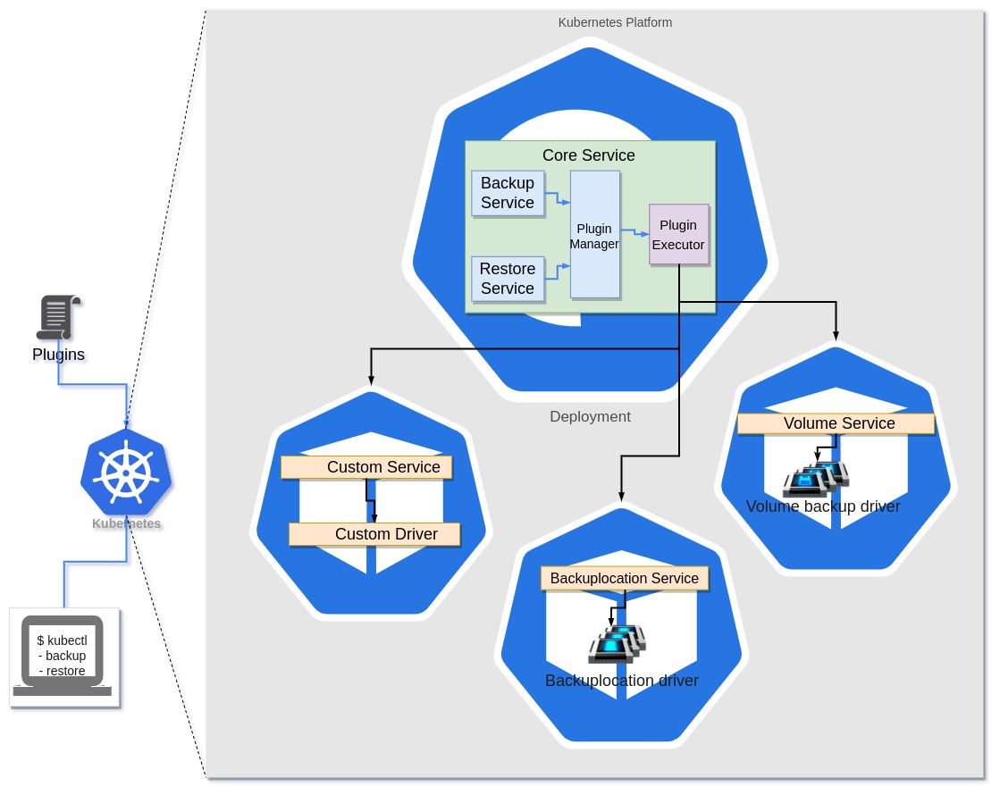
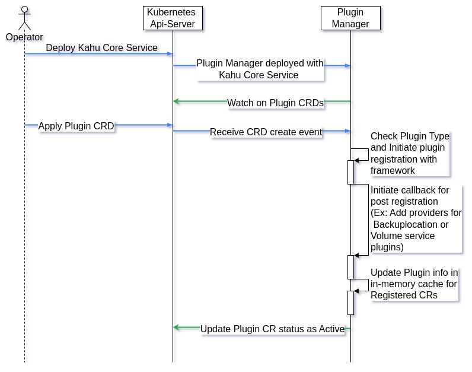

# Data protection plugin framework
Author(s): [Amit Roushan](https://github.com/AmitRoushan) 

January 2023


## Motivation and background
KAHU project under the soda-cdm organisation deals with data protection aspects of container data management on 
Kubernetes. Currently, Kahu supports different volume backup and backup location with Provider framework. 
The framework provides a plugin approach to integrated Volume/BackupLocation driver in runtime itself.

Currently, Volume/BackupLocation drivers are deployed either as “Deployment” or “Statefulset”. 
The solution works perfectly if the drive uses APIs to connect with respective volume/backuploction servers. 
But at same time the approach has limitations
- If backup/restore drivers are data movers (like Restic).
- If volumes are topologically distributed
- Kubernetes does not support hot mount functionality, So if any Volume backup driver needs “Volume” 
  mount for backup/restore. Current approach will be failure Data protection is a scheduled operation. 
  So running a driver process and waiting for a backup/restore request to process is a waste of memory and CPU cycles.

The document proposes an alternative approach to accept volume backup driver and backup location driver as plugin
and schedule a Kubernetes pod to process backup/restore request

The plugin approach also brings in advantages in scenario like:
- Custom command execution before/after backup/restore
- Resolve dependencies of CRD resources

## Goals
- Define a CRD to accept plugins
- Manage lifecycle of plugins
- Support topology for plugins
- Maintain backward compatibility

## Non-Goals
NA

## Assumptions and Constraints
- The proposal only consider data protection for Containerized Application
- Only accounts Kubernetes as Container orchestration platform

## Requirement Analysis
- Support generic Plugin for Backup location driver, Volume backup drivers and Custom execution hooks.
- Support for Plugin definition
- Add support for Plugin registration
- Add Plugin lifecycle management
- Enable topology in Plugin deployment
- Support parameter configurations during Plugin execution
- Device a way to fetch and maintain plugin job logs
- Enable jobs eventing
- Add garbage collection for plugin jobs
- Ensure backward compatibility

## Architecture Analysis


Kahu supports vendor agnostic container data protection on Kubernetes platform. It defines CRDs (Backup/Restore) for 
accepting backup and restore requests. It also defines a separate set of CRDs (BackupLocation/Providers) for Backup 
Location and Volume backup drivers registration.  
Kahu deployment involves core services as pod with “Deployment” and BackupLocation driver and volume backup drives as
“Deployment” again. Kahu provides side cars (Metadata/Volume service) which get deployed alongside Backuplocation 
driver and Volume backup drivers respectively.  
Once Kahu deployment is done, Users can submit backup/restore requests and provide respective filters to select 
resources for backup/restore.

Please refer [Design Doc](https://github.com/soda-cdm/documentation/blob/main/kahu/design_spec.md) for details


## Current data protection flow
As described in architecture analysis, Users can submit backup/restore requests through defined “Backup/Restore” CRDs.
The submitted requests are further processed by Backup/restore services in core service.

### Backup flow:
- Backup service is a controller (backup controller) which response on Add and Update events on Backup objects
- Backup controller analyse backup request filters (include/exclude namespaces, include/exclude resources and 
  label selectors).
- Based on the filters set in request, Backup controller fetches all resources from kubernetes and adds them 
  to in-memory cache for processing.
- Backup controller analyses all Volume resources from the cache and creates a volume group. It further creates 
  VolumeSnapshot objects based on the available volume providers. Backup controller waits to finish all Volume 
  snapshot processing.
- VolumeSnapshot object is getting watched by VolumeSnpahot Controller. It analyses if the Volumes are provisioned 
  through CSI.
  - If volumes are provisioned through CSI drivers, VolumeSnpshotController creates a CSI VolumeSnapshot object and
    waits for the snapshot to finish.
  - If volumes are not provisioned through CSI, VolumeSnapshotController does not perform any operation. It expects 
    an external volume snapshot controller to handle the VolumeSnapshotObject and update the status to success.
- Once VolumeSnapshot processing are finished, Backup controller identifies volume backup providers for respective 
  volumes and creates VolumeBackupContent (VBC) for the volume backup.
- Volume backup drivers are responsible for processing VBC objects. Backup drivers are deployed with volume service 
  sidecar.
- Volume service sidecars process VBC objects and initiate Backup GRPC requests to backup driver containers. 
  Once the backup is finished, Volume service update the status in VBC.
- Backup Controller monitors all VBC objects and once VBC status gets updated, Backup controller update Volume backup
  status on Backup objects.
- Once Volume backup finished, All resources from backup in-memory caches are pushed to backup location through 
  Backup location service and update the Backup Object status accordingly.

### Restore flow
- Similar to backup service, restore service is also a controller.
- Restore controller fetches all backup object from backup location with Backup location service.
- Restore controller then apply filters set in Restore objects.
- It creates an in-memory cache and stores all filtered resources.
- Restore like backup controller, fetches all Volume from filtered resources and Create a VolumeRestoreContent
  (VRC) object.
- VRCs are processed by a Volume service container deployed as a sidecar in Volume Backup driver Pod.
- Volume service sidecar fetches PVC information from VRC and initiates a GRPC request to backup drivers for 
  restoring the PVC(PVCs).
- Once the Volume restore finished, Volume service update the status in VRC.
- Restore controller monitors all VRC and update the Restore status accordingly.
- The Restore controller applies all other resources from cache to Kubernetes and update the restore status in 
  Restore object


## Proposed Architecture



### High Level Module Architecture
The proposed design enables the kahu framework to adopt Template design pattern in which resources are treated as 
pluggable entity in different stages of backup/restore workflow. Here proposal introduces a Plugin framework which is 
responsible to maintain and provide reliable interfaces.It introduces a new CRD called “Plugin”. The "Plugin" enables 
end users to register different plugins which the framework can accept and execute on different stages of backup and 
restore.
Plugin framework is composed of two modules: 

- Plugin manager
  
  It is an abstract factory which exposes different interfaces to interact with different registered plugins. Here 
  registered plugins can be 
  - An object which does like to perform some action during backup/restore flow.
    Ex: 
    - Get dependencies of Pods
    - Update resource 
  - A user registered plugin through Plugin CRs
    Ex:
    - Backuplocation provider
    - Volume backup provider
  
  It also encapsulates a controller to watch on Plugin CRs and manages metadata information of all plugins.
  For some special plugins (Metadata Service or Volume Service), It triggers some callbacks like adding 
  Provider CR for respective service. Plugin CRD supports different attributes which helps Plugins to get 
  executed and registered with different capabilities.
  Currently identified Plugins are
  - Volume service provider plugin
  - Backup location provider plugin
  - Custom plugin
  
- Plugin executor
  
  It abstracts out complexities required to run a plugin as Pod/object for execution and provide reliable interfaces to 
  interacts with Plugin manager interfaces.
  
### Impact Analysis
- Upgrade 
- Performance 
- Maintenance 

## Detailed Design
With plugin approach, most of the external components required for data protection workflow gets registered with 
[Plugin CRD](#plugin-crd).

### Backup workflow


### Restore workflow


### Use case View
//Provide system context and typical use cases to determine the scope and boundaries for the module.
#### List of Typical Usecases
//Provide a list of typical usecases
#### Usecase context model
//How is the module in the overall conext of the usecase..typically for a usecase flow...how the module needs to behave...a network diagram with module could help
#### Interface Model
//What are the interfaces for the Modules needed and the view
#### External Interfaces
//Provide the details of the interface, type, why ? any limitations or alternates etc…
#### End User Context
//Analysis and design inputs for the end user of the module
####Functional Context
//Based on the functional requirements, what are the design aspects to be considered. Give all the details and block diagrams etc..
#### Non Functional Context
//Based on the non functional requirements, what are the design aspects to be considered. Give all the details and block diagrams etc..
#### Performance
//What are the design considerations for performance
#### Security
//What are the design considerations for security
#### Other Non Functional Aspects
//What are the design considerations for other non functional requirements

### Data View
#### Data and Control Data Contexts

##### Plugin CRD
```golang
package v1beta1

import (
  metav1 "k8s.io/apimachinery/pkg/apis/meta/v1"
  "k8s.io/api/core/v1"
)

type Plugin struct {
  metav1.TypeMeta `json:",inline"`

  // +optional
  metav1.ObjectMeta `json:"metadata,omitempty"`

  // +optional
  Spec PluginSpec `json:"spec,omitempty"`

  // +optional
  Status PluginStatus `json:"status,omitempty"`
}

type PluginStatus struct {
	// Active status indicate state of the Plugin. 
	Active bool `json:"active,omitempty"`
}

// Plugin specifications
type PluginSpec struct {
	Template v1.PodTemplateSpec `json:"template,omitempty"`
	
	PluginType `json:",inline"`
	
	Parameters map[string]string `json:"parameters,omitempty"`
	
	Capabilities []PluginTypeCapabilities `json:"capabilities,omitempty"`
}

type PluginTypeCapabilities string

const (
	VolumeBackupNeedSnapshotCap PluginTypeCapabilities = "VOLUME_BACKUP_NEED_SNAPSHOT"
	CRDResolver                 PluginTypeCapabilities = "CRD_RESOLVER"
) 

type PluginType struct {
	// Backup location plugin 
	BackupLocation *BackupLocationPluginType `json:"backupLocation,omitempty"`
	
	// Volume backup/restore plugin 
	VolumeService *VolumeServicePluginType `json:"volumeService,omitempty"`

	// custom executor 
	CustomService *CustomServicePluginType `json:"volumeService,omitempty"`
}

type BackupLocationPluginType struct {
	
}

type VolumeServicePluginType struct {

}

type CustomServicePluginType struct {
	PluginHooks []PluginHook `json:"pluginHooks,omitempty"`
}

type PluginHook struct {
	Stage PluginHookStage `json:"stage,omitempty"`
	Resource ResourceSpec `json:"resource,omitempty"`
}

type PluginHookStage string 

const (
	PreBackupHook   PluginHookStage = "PRE_BACKUP_HOOK" 
	PostBackupHook  PluginHookStage = "POST_BACKUP_HOOK" 
	PreRestoreHook  PluginHookStage = "PRE_RESTORE_HOOK" 
	PostRestoreHook PluginHookStage = "POST_RESTORE_HOOK" 
)

```
//Provide the details on data and control data flow
#### Data Model
// Data Structures, key points considered, open and alternate points etc…All the data structure to be added here
Development and Deployment Context
#### Code
//Provide inputs for code structure, language, any open source code can be reused, coding methods, development env etc
#### Debug Model
//how to debug the module, specific logging, debug options etc…
#### Build & Package
//How this module is built along with other modules etc…What is the package model
#### Deployment


#### Deployment Steps
- Cluster admin deploys kahu core services as deployment.
- Different backup location provider, volume backup provider or custom service execution are registered as "Plugin" with 
  kahu system.

#### Execution View
//During the run time, any specific aspects to be considered...like logging to be done for the module etc..It is not functional logs, it is specific to the module maintenance; OR Runtime replication or any such requirements to be considered during the design
#### Sequence Diagrams

- Plugin Registration

  

//Provide the key control and data flow sequence diagrams here
#### Design Alternatives and other notes
//If you have any other ideas or alternate suggestions or notes which needs further analysis or later consideration, please add here
#### Open Issues
//All the open issues go here. Please track it else where to closure
#### Design Requirements / Tasks
//List of detailed tasks for this module go here. Based on all the design and analysis, please list all the tasks to be completed for the implementation and release of the module. If you are updating the overall task list or location, please provide the links or ids here...This is to get an overall consolidation of task items for this module


