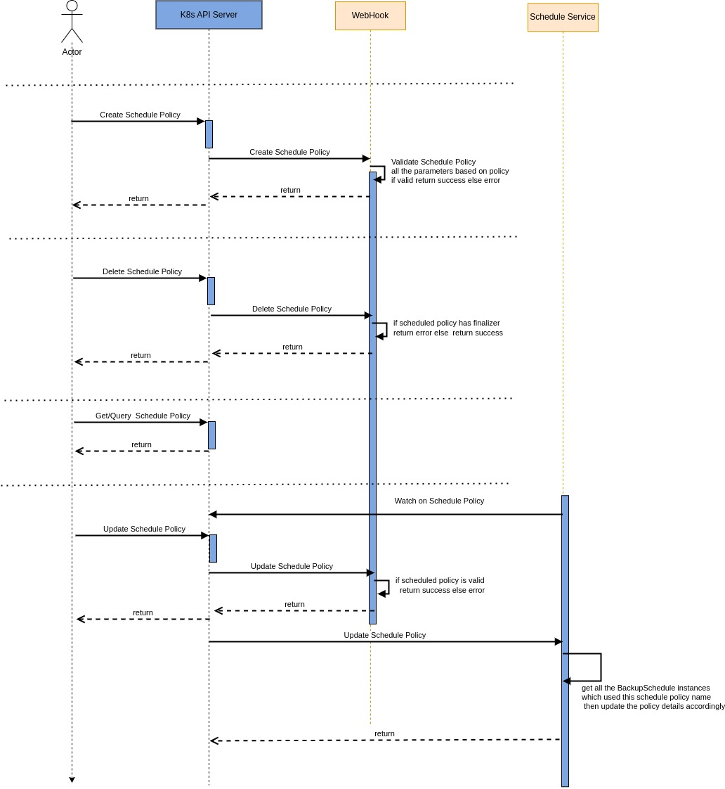
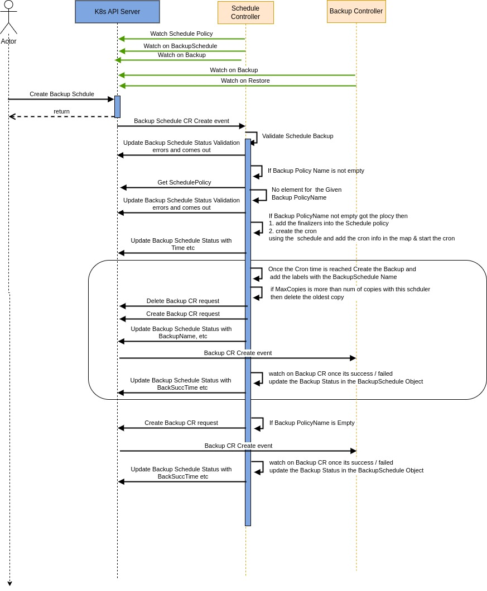

# Schedule Based Backup
Author(s): [Chilveri Srinivas](https://github.com/SrinivasChilveri) 

January 2023


## Motivation and background
KAHU project under the soda-cdm organisation deals with data protection aspects of container data management on 
Kubernetes.Currently the Kahu system doesn’t support scheduled based backups, so the user has to manually trigger the backup operation every time which is a very tedious task. So the kahu system should support the schedule based backup operation.
will be going to cover the Schedule Policy and Scheduled based backups related analysis and design in this document.

## Goals
    • Define a CRD for Backup Schedule Policy
    • Define a CRD for Scheduled Backup
    • Support Schedule based backup operation
    • Define a CRD for Restore Schedule
    • Support Restore from the latest successful scheduled backup
    • Should not break the backward compatibility


## Non-Goals
    • The proposal only consider time based schedule policy and operation
    • Only considered in-cluster scheduling and restore 


## Assumptions and Constraints
    • The proposal only consider time based schedule policy and operation
    • Only considered in-cluster scheduling and restore 


## Architecture Analysis


Kahu supports vendor agnostic container data protection on Kubernetes platform. It defines CRDs (Backup/Restore) for accepting backup and restore requests. It also defines a separate set of CRDs (BackupLocation/Providers) for Backup Location and Volume backup drivers registration.  
Kahu deployment involves core services as pod with “Deployment” and BackupLocation driver and volume backup drives as “Deployment” again. Kahu provides side cars (Metadata/Volume service) which get deployed alongside Backuplocation driver and Volume backup drivers respectively.  
Once Kahu deployment is done, Users can submit backup/restore requests and provide respective filters to select resources for backup/restore.
Please refer [Design Doc](https://github.com/soda-cdm/documentation/blob/main/kahu/design_spec.md) for details


## Current data protection flow
As described in architecture analysis, Users can submit backup/restore requests through defined “Backup/Restore” CRDs.
The submitted requests are further processed by Backup/restore services in core service.


## Proposed Architecture for Data Protection Management

### High Level Module Architecture

The proposed design enables the scheduled based backup and which does not change anything in the exsist kahu-core design but enhances kahu system to support schedule based backups. In future it can be enhanced to support different kinds of schedules such as adaptive scheduling which can be implemented based on other futures such as observability features such as  events etc.


The Schedule format and logic would be similar to the above crontab and see low level design/CRDs for more information.
The CRDs are defined namespace scope and schedule service will be deployed in the same namespace which will be taken input from the user during the deployment as an optional parameter.
Previously Users can submit backup/restore requests through defined “Backup/Restore” CRDs.The submitted requests are further processed by Backup/restore services in Kahu core service.

But on introducing the scheduled based backup users can create the new CRD (for backup BackupSchedule) so the schedule service will create the actual internal Backup CRD thru the k8s-api server. So the backup service part of core service will be watching and handling the core backup logic as before in the kahu system. So based on the provided schedule policy the schedule service will triggers the backup operation. 

Similar to before, users have to create the Backup Location etc but with scheduled backup users have to create the Schedule Policy CRD instances by Schedule Policy CR(whose name is supposed to be provided in the new Scheduled based backup CRD) before creating the new BackupSchedule CRD instance using the BackupSchedule CR (BackupSchedule).

So the Scheduled Based Backup will depend on the Kahu Core services to support the Backup & Restore CRDs etc. 


The Job Management & Schedule approaches can be achieved by
    1. Using the k8s CronJob
    2. Using the open source (https://github.com/robfig/cron).

The pros and cons of both the approaches as below

k8s-CronJob
	Pros: Better reliability 
      Cons: 1) Tightly coupled with k8s Cron-job, so any changes in Cron-job of
			 k8s may have impact on our code
		2)Its Complex
		3) for small task need to create an image which has to be used Cron-
			Job & its mgmt also complex
		4)Need to watch on CronJob
OpenSource
	Pros: 1)Full control with us
		2)Easy to implement & Manage using open source
		3)Easy to handle/change the required things as code base is small as
			required to us. If required esy to enhance it

	Cons: Little less reliable than Cron-Job


The Backup operation is not completed within the given scheduled time then we better not trigger/create the new Backup CR, so wait for the completion of the on-going Backup operation then trigger the new backup or postpone the Backup creation or schedule triggering to the next scheduled time or delay the trigger.


  
## Detailed Design

### Use case View
//Provide system context and typical use cases to determine the scope and boundaries for the module.

#### List of Typical Usecases
    • The Application Admin can trigger the Scheduled based backup operation to backup the applications metadata and data based on the provided schedule(hourly,daily,weekly,monthly etc)
    • The Application Admin can trigger the Restore from the schedule based backup latest copy 


#### Usecase context model
//How is the module in the overall conext of the usecase..typically for a usecase flow...how the module needs to behave...a network diagram with module could help
#### Interface Model
//What are the interfaces for the Modules needed and the view


#### External Interfaces
//Provide the details of the interface, type, why ? any limitations or alternates etc…

User Can do the below operations on the Schedule Policy using the kubectl
    1. Create the Schedule Policy CRD: Web hook validates the CRD , if validation success the object is created and stored, otherwise the web-hook returns error response
    2. Query the Schedule Policy CRD: k8s-api server returns the queried scheduled policy instance if it exists, otherwise returns empty results.
    3. Delete the Schedule Policy CRD: web-hooks checks for the finalizers , if any finalizers exists return failure otherwise deletes the instance and returns success
    4. Update the Schedule Policy CRD: As web-hooks validates and updates the instance. Schedule service watches on the Schedule Policy so on receiving the updated schedule policy the schedule service updates this policy to all the applied scheduled backup instances which will take effect on the next trigger only.
User Can do the below operations on the BackupSchedule using the kubectl
    1. Create the BackupSchedule CRD: Schedule service validates the CRD , if validation fails returns error response otherwise  continuous the operation
    2. Query the BackupSchedule CRD: k8s-api server returns the queried BackupSchedule instance if it exists, otherwise returns empty results.
    3. Delete the BackupSchedule CRD: Schedule service checks for the instance. If ReclaimPolicy is delete then deletes all the backup objects which are created by the BackupSchduled CRD otherwise deletes the instance and returns success,so its users responsibility to delete the Backup instances which were created by the Backup Schedule in case of Reclaim policy
    4. Update the BackupSchedule CRD: Schedule service watches on the BackupSchedule. Validate for the update operation on receiving the updated BackupSchedule instance & based on the changed parameters the schedule service updates the parameters and acts accordingly.

#### End User Context
//Analysis and design inputs for the end user of the module
####Functional Context
//Based on the functional requirements, what are the design aspects to be considered. Give all the details and block diagrams etc..
#### Non Functional Context
//Based on the non functional requirements, what are the design aspects to be considered. Give all the details and block diagrams etc..
#### Performance
//What are the design considerations for performance

The Scheduler service can be deployed as HA deployment similar to the k8s-controllers. We need to handle the job-management properly to support reliability in case of schduler service restarts.


#### Security
//What are the design considerations for security
#### Other Non Functional Aspects
//What are the design considerations for other non functional requirements

### Data View
#### Data and Control Data Contexts
//Provide the details on data and control data flow
#### Data Model
// Data Structures, key points considered, open and alternate points etc…All the data structure to be added here
Development and Deployment Context

The Schedule Policy related CRDs and more granular info as follows

```golang
var DaysType map[string]time.Weekday {
   "Sunday":   time.Sunday,
   "Sun" :     time.Sunday,
   "Monday":   time.Monday,
   "Mon":      time.Monday,
   "Tuesday":  time.Tuesday,
   "Tue":      time.Tuesday,
   "Wednesday":time.Wednesday,
   "Wed":     time.Wednesday,
   "Thursday": time.Thursday,
   "Thurs":    time.Thursday,
   "Friday":   time.Friday,
   "Fri":      time.Friday,
   "Saturday": time.Saturday,
   "Sat":      time.Saturday,
}
const (
   HourlyPolicyType  string =  "Hourly"
   DailyPolicyType   string =  "Daily"
   WeeklyPolicyType  string =  "Weekly"
   MonthlyPolicyType string =  "Monthly"
)
// for every number of minutes the schedule will be triggered
type HourlyPolicy  struct {
   // Minutes when the policy should be triggered
   // +kubebuilder:validation:Maximum=59
   // +kubebuilder:validation:Minimum=0
   // +kubebuilder:validation:Required
   Minutes int     `json:"minutes"`
   // +kubebuilder:validation:Maximum=256
   // +kubebuilder:validation:Minimum=1
   // +kubebuilder:default=25
   // +kubebuilder:validation:Optional
   MaxCopies int   `json:"maxCopies"`
}
// Daily Policy contains the time in the day when the action should be triggered
type DailyPolicy  struct {
   // Time when the policy should be triggered
   // time eg 12:15
   // +kubebuilder:validation:Required
   Time  string    `json:"time"`
   // +kubebuilder:validation:Maximum=256
   // +kubebuilder:validation:Minimum=1
   // +kubebuilder:default=15
   // +kubebuilder:validation:Optional
   MaxCopies int   `json:"maxCopies"`  
}
// Weekly Policy contains the days and time  in a week when the action should be triggered
type WeeklyPolicy  struct {
   // Days of the week when the policy should be triggered.
   // Expected format is  specified in  DaysType as above
   // +kubebuilder:validation:Required
   Days [] string `json:"days"`
   // +kubebuilder:validation:Required
   Time  string `json:"time"`
   // +kubebuilder:validation:Maximum=256
   // +kubebuilder:validation:Minimum=1
   // +kubebuilder:default=5
   // +kubebuilder:validation:Optional
   MaxCopies int       `json:"maxCopies"` 
}
// Monthly Policy contains the dates and time  in a month when the action should be triggered
type MonthlyPolicy  struct {
// Dates of the month when action should be triggered. If given date does not exist in a month then rollover to the next
// date of month. Example 31 is specified then in Feb it will trigger on either 1st or 2nd March based on leap year or not.
   // +kubebuilder:validation:Required
   Dates [] int `json:"dates"`
   // eg 12:15
   // +kubebuilder:validation:Required
   Time  string `json:"time"`
   // +kubebuilder:validation:Maximum=256
   // +kubebuilder:validation:Minimum=1
   // +kubebuilder:default=5
   // +kubebuilder:validation:Optional
   MaxCopies int    `json:"maxCopies"`
}
type SchedulePolicySpec  struct {
   Hourly  *HourlyPolicy       `json:"hourly,omitempty"`
   Daily   *DailyPolicy        `json:"daily,omitempty"`
   Weekly  *WeeklyPolicy       `json:"weekly,omitempty"`
   Monthly *MonthlyPolicy      `json:"monthly,omitempty"` 
}
type SchedulePolicy struct {
   metav1.TypeMeta `json:",inline"`  
   metav1.ObjectMeta `json:"metadata,omitempty"`
   Spec  SchedulePolicySpec `json:"spec,omitempty"`  
}
// SchedulePolicyList contains a List of SchedulePolicy
type SchedulePolicyList struct {
   metav1.TypeMeta `json:",inline"`
   metav1.ObjectMeta `json:"metadata,omitempty"`
   Items []SchedulePolicy `json:"items"`
}

```

#### Code
//Provide inputs for code structure, language, any open source code can be reused, coding methods, development env etc
#### Debug Model
//how to debug the module, specific logging, debug options etc…
#### Build & Package
//How this module is built along with other modules etc…What is the package model
#### Deployment
//How to install and deploy the module in the system, hardware resource requirements etc. Any other network or such requirements..like client or http server needed etc…
#### Execution View
//During the run time, any specific aspects to be considered...like logging to be done for the module etc..It is not functional logs, it is specific to the module maintenance; OR Runtime replication or any such requirements to be considered during the design
#### Sequence Diagrams
//Provide the key control and data flow sequence diagrams here







#### Design Alternatives and other notes
//If you have any other ideas or alternate suggestions or notes which needs further analysis or later consideration, please add here
#### Open Issues
//All the open issues go here. Please track it else where to closure
#### Design Requirements / Tasks
//List of detailed tasks for this module go here. Based on all the design and analysis, please list all the tasks to be completed for the implementation and release of the module. If you are updating the overall task list or location, please provide the links or ids here...This is to get an overall consolidation of task items for this module


