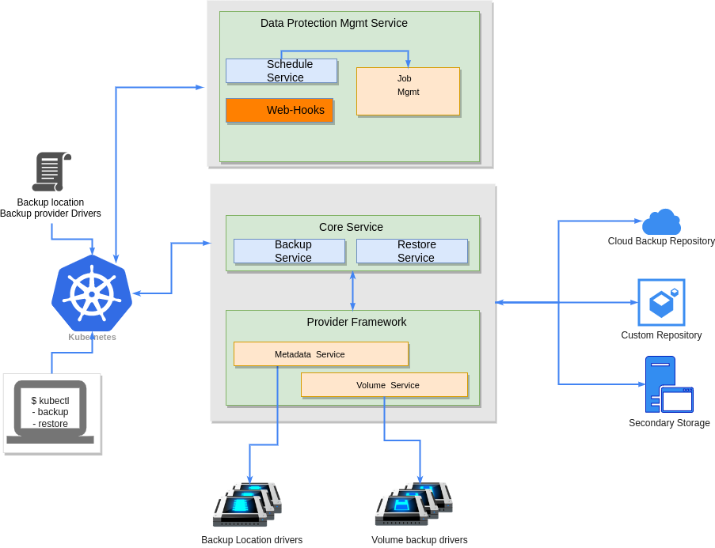
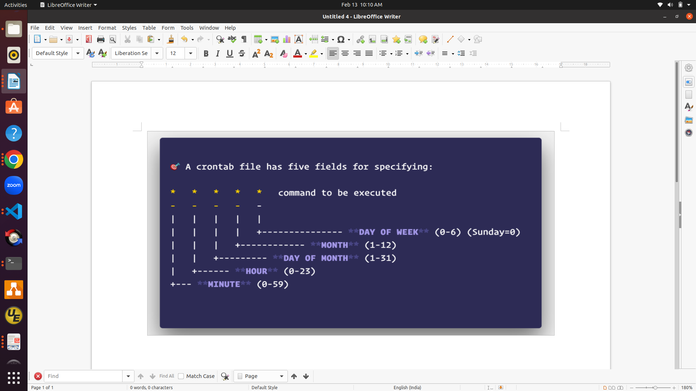

# Schedule Based Backup
Author(s): [Chilveri Srinivas](https://github.com/SrinivasChilveri) 

January 2023


## Motivation and background
KAHU project under the soda-cdm organisation deals with data protection aspects of container data management on 
Kubernetes.Currently the Kahu system doesn’t support scheduled based backups, so the user has to manually trigger the backup operation every time which is a very tedious task. So the kahu system should support the schedule based backup operation.
will be going to cover the Schedule Policy and Scheduled based backups related analysis and design in this document.

## Goals
    • Define a CRD for Backup Schedule Policy
    • Define a CRD for Scheduled Backup
    • Support Schedule based backup operation
    • Define a CRD for Restore the latest Scheduled Backup
    • Support Restore from the latest successful scheduled backup
    • Should not break the backward compatibility


## Non-Goals
    • The proposal only consider time based schedule policy and operation
    • Only considered in-cluster scheduling and restore 


## Assumptions and Constraints
    • The proposal only consider time based schedule policy and operation
    • Only considered in-cluster scheduling and restore 


## Architecture Analysis


Kahu supports vendor agnostic container data protection on Kubernetes platform. It defines CRDs (Backup/Restore) for accepting backup and restore requests. It also defines a separate set of CRDs (BackupLocation/Providers) for Backup Location and Volume backup drivers registration.  
Kahu deployment involves core services as pod with “Deployment” and BackupLocation driver and volume backup drives as “Deployment” again. Kahu provides side cars (Metadata/Volume service) which get deployed alongside Backuplocation driver and Volume backup drivers respectively.  
Once Kahu deployment is done, Users can submit backup/restore requests and provide respective filters to select resources for backup/restore.
Please refer [Design Doc](https://github.com/soda-cdm/documentation/blob/main/kahu/design_spec.md) for details


## Current data protection flow
As described in architecture analysis, Users can submit backup/restore requests through defined “Backup/Restore” CRDs.
The submitted requests are further processed by Backup/restore services in core service.


## Proposed Architecture for Data Protection Management

### High Level Module Architecture

The proposed design enables the scheduled based backup and which does not change anything in the exsist kahu-core design but enhances kahu system to support schedule based backups. In future it can be enhanced to support different kinds of schedules such as adaptive scheduling which can be implemented based on other futures such as observability features such as  events etc.



The Schedule format and logic would be similar to the above crontab and see low level design/CRDs for more information.
The CRDs are defined namespace scope and schedule service will be deployed in the same namespace which will be taken input from the user during the deployment as an optional parameter.
Previously Users can submit backup/restore requests through defined “Backup/Restore” CRDs.The submitted requests are further processed by Backup/restore services in Kahu core service.

But on introducing the scheduled based backup users can create the new CRD (for backup BackupSchedule) so the schedule service will create the actual internal Backup CRD thru the k8s-api server. So the backup service part of core service will be watching and handling the core backup logic as before in the kahu system. So based on the provided schedule policy the schedule service will triggers the backup operation. 

Similar to before, users have to create the Backup Location etc but with scheduled backup users have to create the Schedule Policy CRD instances by Schedule Policy CR(whose name is supposed to be provided in the new Scheduled based backup CRD) before creating the new BackupSchedule CRD instance using the BackupSchedule CR (BackupSchedule).

So the Scheduled Based Backup will depend on the Kahu Core services to support the Backup & Restore CRDs etc but kahu service will not depend on the scheduled based backup service. 


The Job Management & Schedule approaches can be achieved by
    1. Using the k8s CronJob
    2. Using the open source (https://github.com/robfig/cron).

The pros and cons of both the approaches as below

- k8s-CronJob

	Pros: Better reliability 
      
   Cons: 1) Tightly coupled with k8s Cron-job, so any changes in Cron-job of
			   k8s may have impact on our code
		   2) Its Complex
		   3) for small task need to create an image which has to be used Cron-
			   Job & its mgmt also complex
		   4) Need to watch on CronJob

- OpenSource

	Pros: 1) Full control with us
		   2) Easy to implement & Manage using open source
		   3) Easy to handle/change the required things as code base is small as
			   required to us. If required esy to enhance it

	Cons: Little less reliable than Cron-Job


The Backup operation is not completed within the given scheduled time then we better not trigger/create the new Backup CR, so wait for the completion of the on-going Backup operation then trigger the new backup or postpone the Backup creation or schedule triggering to the next scheduled time or delay the trigger.


  
## Detailed Design

### Use case View
//Provide system context and typical use cases to determine the scope and boundaries for the module.

#### List of Typical Usecases
    • The Application Admin can trigger the Scheduled based backup operation to backup the applications metadata and data based on the provided schedule(hourly,daily,weekly,monthly etc)
    • The Application Admin can trigger the Restore from the schedule based backup latest copy 


#### Usecase context model
//How is the module in the overall conext of the usecase..typically for a usecase flow...how the module needs to behave...a network diagram with module could help
#### Interface Model
//What are the interfaces for the Modules needed and the view

The open source (https://github.com/robfig/cron) already provided below interfaces for cron


```golang

   func New(opts ...Option) *Cron

   func (c *Cron) AddFunc(spec string, cmd func()) (EntryID, error)

   c := cron.New()
	c.AddFunc("30 * * * *", func() { fmt.Println("Every hour on the half hour") })

	c := cron.New(cron.WithChain(
		cron.DelayIfStillRunning(logger),
	))

   c := cron.New(cron.WithChain(
		cron.SkipIfStillRunning(logger),
	))

```

The controller service related 

#### External Interfaces
//Provide the details of the interface, type, why ? any limitations or alternates etc…

- User Can do the below operations on the Schedule Policy using the kubectl
    1. Create the Schedule Policy CRD: Web hook validates the CRD , if validation success the object is created and stored, otherwise the web-hook returns error response
    2. Query the Schedule Policy CRD: k8s-api server returns the queried scheduled policy instance if it exists, otherwise returns empty results.
    3. Delete the Schedule Policy CRD: web-hooks checks for the finalizers , if any finalizers exists return failure otherwise deletes the instance and returns success
    4. Update the Schedule Policy CRD: As web-hooks validates and updates the instance. Schedule service watches on the Schedule Policy so on receiving the updated schedule policy the schedule service updates this policy to all the applied scheduled backup instances which will take effect on the next trigger only.
- User Can do the below operations on the BackupSchedule using the kubectl
    1. Create the BackupSchedule CRD: Schedule service validates the CRD , if validation fails returns error response otherwise  continuous the operation
    2. Query the BackupSchedule CRD: k8s-api server returns the queried BackupSchedule instance if it exists, otherwise returns empty results.
    3. Delete the BackupSchedule CRD: Schedule service checks for the instance. If ReclaimPolicy is delete then deletes all the backup objects which are created by the BackupSchduled CRD otherwise deletes the instance and returns success,so its users responsibility to delete the Backup instances which were created by the Backup Schedule in case of Reclaim policy
    4. Update the BackupSchedule CRD: Schedule service watches on the BackupSchedule. Validate for the update operation on receiving the updated BackupSchedule instance & based on the changed parameters the schedule service updates the parameters and acts accordingly.

#### End User Context
//Analysis and design inputs for the end user of the module
####Functional Context
//Based on the functional requirements, what are the design aspects to be considered. Give all the details and block diagrams etc..
#### Non Functional Context
//Based on the non functional requirements, what are the design aspects to be considered. Give all the details and block diagrams etc..
#### Performance
//What are the design considerations for performance

The Scheduler service can be deployed as HA deployment similar to the k8s-controllers. We need to handle the job-management properly to support reliability in case of schduler service restarts.


#### Security
//What are the design considerations for security
#### Other Non Functional Aspects
//What are the design considerations for other non functional requirements

### Data View
#### Data and Control Data Contexts
//Provide the details on data and control data flow
#### Data Model
// Data Structures, key points considered, open and alternate points etc…All the data structure to be added here
Development and Deployment Context

- The Schedule Policy related CRDs and more granular info as follows

The specific interpretation of the format is based on the Cron Wikipedia page:
https://en.wikipedia.org/wiki/Cron

## Special Characters which are used in our cron logic

-Asterisk ( * )

The asterisk indicates that the cron expression will match for all values of the
field; e.g., using an asterisk in the 5th field (month) would indicate every
month.

-Comma ( , )

Commas are used to separate items of a list. For example, using "MON,WED,FRI" in
the 5th field (day of week) would mean Mondays, Wednesdays and Fridays.

-Question mark ( ? )

Question mark may be used instead of '*' for leaving either day-of-month or
day-of-week blank.

A cron expression represents a set of times, using 5 space-separated fields.

	Field name   | Mandatory? | Allowed values  | Allowed special characters
	----------   | ---------- | --------------  | --------------------------
	Minutes      | Yes        | 0-59            | * / , -     (NA)
	Hours        | Yes        | 0-23            | * / , -     (NA)
	Day of month | Yes        | 1-31            | * / , - ?   (?)
	Month        | Yes        | 1-12 or JAN-DEC | * / , -     (*)
	Day of week  | Yes        | 0-6 or SUN-SAT  | * / , - ?   (?)
   
for each policy the examples are given on structures defination

```golang
package v1beta1

import (	
	"time"
	metav1 "k8s.io/apimachinery/pkg/apis/meta/v1"
)
var DaysType = map[string]time.Weekday {
   "Sunday":   time.Sunday,
   "Sun" :     time.Sunday,
   "Monday":   time.Monday,
   "Mon":      time.Monday,
   "Tuesday":  time.Tuesday,
   "Tue":      time.Tuesday,
   "Wednesday":time.Wednesday,
   "Wed":      time.Wednesday,
   "Thursday": time.Thursday,
   "Thurs":    time.Thursday,
   "Friday":   time.Friday,
   "Fri":      time.Friday,
   "Saturday": time.Saturday,
   "Sat":      time.Saturday,
}
const (
   HourlyPolicyType  string =  "Hourly"
   DailyPolicyType   string =  "Daily"
   WeeklyPolicyType  string =  "Weekly"
   MonthlyPolicyType string =  "Monthly"
)
// for every number of minutes after every hour the schedule will be triggered
// the cron example  25 * * * * (so every hour after 25 minutes triggers)
type HourlyPolicy  struct {
   // Minutes when the policy should be triggered
   // +kubebuilder:validation:Maximum=59
   // +kubebuilder:validation:Minimum=0
   // +kubebuilder:validation:Required
   Minutes int     `json:"minutes"`
   // +kubebuilder:validation:Maximum=256
   // +kubebuilder:validation:Minimum=1
   // +kubebuilder:default=24
   // +kubebuilder:validation:Optional
   MaxCopies int   `json:"maxCopies"`
}
// Daily Policy contains the time in the day when the action should be triggered
// the cron example  20 16 * * *  (so every day at 16:20 Hrs triggers)
type DailyPolicy  struct {
   // Time when the policy should be triggered
   // time eg 12:15
   // +kubebuilder:validation:Required
   Time  string    `json:"time"`
   // +kubebuilder:validation:Maximum=256
   // +kubebuilder:validation:Minimum=1
   // +kubebuilder:default=15
   // +kubebuilder:validation:Optional
   MaxCopies int   `json:"maxCopies"`  
}
// Weekly Policy contains the days and time  in a week when the action should be triggered
// the cron example  25 11 ? * (1,2) (so on Mon,Tues at 11:25 Hrs triggers)
type WeeklyPolicy  struct {
   // Days of the week when the policy should be triggered.
   // Expected format is  specified in  DaysType as above
   // +kubebuilder:validation:Required
   Days [] string `json:"days"`
   // +kubebuilder:validation:Required
   Time  string `json:"time"`
   // +kubebuilder:validation:Maximum=256
   // +kubebuilder:validation:Minimum=1
   // +kubebuilder:default=4
   // +kubebuilder:validation:Optional
   MaxCopies int       `json:"maxCopies"` 
}
// Monthly Policy contains the dates and time  in a month when the action should be triggered
// the cron example  25 11 (1,5,8,11,18) * ? 
// (so on given dates every month at 11:25 Hrs triggers)
type MonthlyPolicy  struct {
// Dates of the month when action should be triggered. If given date does not exist in a month then rollover to the next
// date of month. Example 31 is specified then in Feb it will trigger on either 1st or 2nd March based on leap year or not.
   // +kubebuilder:validation:Required
   Dates [] int `json:"dates"`
   // eg 12:15
   // +kubebuilder:validation:Required
   Time  string `json:"time"`
   // +kubebuilder:validation:Maximum=256
   // +kubebuilder:validation:Minimum=1
   // +kubebuilder:default=12
   // +kubebuilder:validation:Optional
   MaxCopies int    `json:"maxCopies"`
}
// SchedulePolicyspec
type SchedulePolicySpec  struct {
   Hourly  *HourlyPolicy       `json:"hourly,omitempty"`
   Daily   *DailyPolicy        `json:"daily,omitempty"`
   Weekly  *WeeklyPolicy       `json:"weekly,omitempty"`
   Monthly *MonthlyPolicy      `json:"monthly,omitempty"` 
}
// SchedulePolicy is the Schema for the policy API
// +genclient
// +k8s:deepcopy-gen:interfaces=k8s.io/apimachinery/pkg/runtime.Object
// +kubebuilder:printcolumn:name="Age",type=date,JSONPath=`.metadata.creationTimestamp`
type SchedulePolicy struct {
   metav1.TypeMeta `json:",inline"`  
   metav1.ObjectMeta `json:"metadata,omitempty"`
   Spec  SchedulePolicySpec `json:"spec,omitempty"`  
}
// SchedulePolicyList contains a List of SchedulePolicy
// +k8s:deepcopy-gen:interfaces=k8s.io/apimachinery/pkg/runtime.Object
type SchedulePolicyList struct {
   metav1.TypeMeta `json:",inline"`
   metav1.ObjectMeta `json:"metadata,omitempty"`
   Items []SchedulePolicy `json:"items"`
}

```

- The BackupSchedule related CRDs and more granular info as follows

```golang

// ConcurrencyPolicy describes how the BackupSchedule will be handled.
// Only one of the following concurrent policies may be specified.
// If none of the following policies is specified, the default one
// is ForbidConcurrent.
type ConcurrencyPolicy string

const (
	// AllowConcurrent allows Backup to run concurrently.
	AllowConcurrent ConcurrencyPolicy = "Allow"

	// ForbidConcurrent forbids concurrent runs, skipping next run if previous
	// hasn't finished yet.
	ForbidConcurrent ConcurrencyPolicy = "Forbid"

	// ReplaceConcurrent cancels currently running Backup and replaces it with a new one.
	ReplaceConcurrent ConcurrencyPolicy = "Replace"
)

type BackupScheduleSpec  struct {  
   // optional, name of the SchedulePolicy CR
   // if empty considered as manual trigger otherwise scheduled based backup will be taken
   BackupPolicyName string  `json:"backupPolicyName"`  
   // ReclaimPolicy tells about reclamation of the backup. It can be either delete or retain
   // +kubebuilder:default= retain
   // +kubebuilder:validation:Optional
   ReclaimPolicy ReclaimPolicyType `json:"reclaimPolicy,omitempty"`
   // Enable tells whether  Scheduled Backup should be started or stopped
   // +optional
   // +kubebuilder:default=true
   // +kubebuilder:validation:Optional
   Enable bool     `json:"enable,omitempty"`
   // +kubebuilder:validation:Maximum=5
   // +kubebuilder:validation:Minimum=1
   // +kubebuilder:default=3
   // +kubebuilder:validation:Optional
   MaxRetriesOnFailure int `json:"maxRetriesOnFailure"`
 // Optional deadline in seconds for starting the Backup if it  misses   // scheduled time for any reason.
   // +optional
   StartingDeadlineSeconds *int64 `json:"startingDeadlineSeconds,omitempty"`
// Specifies how to treat concurrent executions of a Backup.
// Valid values are:
// - "Allow": allows Backups to run concurrently;
// - "Forbid"(default): forbids concurrent runs, skipping next run if    // previous run hasn't finished yet;
// - "Replace": cancels currently running job and replaces it with a new // one
   // +optional
   ConcurrencyPolicy ConcurrencyPolicy `json:"concurrencyPolicy”`
   // this Backup spec
   BackupTemplate BackupSpec `json:"template,omitempty"`
}
type ScheduleStatus  string
type ExecutionStatus string
const(
   SchedulePending    ScheduleStatus = "Pending"
   ScheduleActive     ScheduleStatus = "Active"
   ScheduleInActive   ScheduleStatus = "InActive"
   ScheduleFailed     ScheduleStatus = "Failed"
   ScheduleDeleting   ScheduleStatus = "Deleting"
   
   ExecutionSuccess     ExecutionStatus = "Success"
   ExecutionInProgress  ExecutionStatus = "InProgress"
   ExecutionFailure     ExecutionStatus = "Failed"
)
type StatusInfo struct {
    BackupName string     `json:"backupName"`
    ExecStatus ExecutionStatus   `json:"execStatus"`
    StartTimestamp metav1.Time `json:"startTimestamp"`
    CompletionTimestamp metav1.Time `json:"completionTimestamp"`
}
type BackupScheduleStatus struct {
   // latest 10 scheduled backup status is stored
   RecentStatusInfo [] StatusInfo `json:"recentStatusInfo"`
   LastBackupName string `json:"lastBackupName"`
   LastExecutionStatus ExecutionStatus `json:"lastExecutionStatus"`
   // LastStartTimestamp is defines time when Schedule created the backup 
   LastStartTimestamp metav1.Time `json:"lastStartTimestamp"`
   // LastCompletionTimestamp is defines time when backup completed
   LastCompletionTimestamp metav1.Time `json:"lastCompletionTimestamp"`
   SchedStatus  ScheduleStatus  `json:"schedStatus"`
   // the created backup crd status used to identify the completed or not
   BackupStatus BackupState `json:"backupStatus"`
}
// +genclient
// +kubebuilder:subresource:status
// +k8s:deepcopy-gen:interfaces=k8s.io/apimachinery/pkg/runtime.Object
// +kubebuilder:printcolumn:name="Age",type=date,JSONPath=`.metadata.creationTimestamp`
type BackupSchedule struct {
   metav1.TypeMeta `json:",inline"`
   metav1.ObjectMeta `json:"metadata,omitempty"`
   Spec  BackupScheduleSpec `json:"spec,omitempty"`
   Status BackupScheduleStatus `json:"status,omitempty"`
}
// BackupScheduleList contains a List of BackupSchedule
// +k8s:deepcopy-gen:interfaces=k8s.io/apimachinery/pkg/runtime.Object
type BackupScheduleList struct {
   metav1.TypeMeta `json:",inline"`
   metav1.ObjectMeta `json:"metadata,omitempty"`
   Items []BackupSchedule `json:"items"`
}

```


Restore from the latest scheduled backup related CRDs are as follows but  i feel
We better just add the BackupScheduleName in the current Restore CRD so that its 
Very simple to handle this feature on implementing the client which will take care 
Of validations etc but with this approach kahu will depends on the Management layer    
Created object instances otherwise we may need to implement the web-hook for this 
CRD so that validation are taken care.

```golang

type RestoreScheduleStatus struct {
   BackupName string `json:"backupName"`
   ExecutionStatus ExecutionStatus `json:"executionStatus"`
   StartTimestamp metav1.Time `json:"startTimestamp"`
   CompletionTimestamp metav1.Time `json:"completionTimestamp"`
   // the created restore crd status
   // +optional
   State RestoreState `json:"state,omitempty"`
   // ValidationErrors is a slice of validation errors during restore
   ValidationErrors []string `json:"validationErrors,omitempty"`
}

// +genclient
// +kubebuilder:subresource:status
// +k8s:deepcopy-gen:interfaces=k8s.io/apimachinery/pkg/runtime.Object
// +kubebuilder:printcolumn:name="Age",type=date,JSONPath=`.metadata.creationTimestamp`
type RestoreScheduleSpec struct {
   // BackupScheduleName is BackupSchedule CR Name   
	// +required
   BackupScheduleName string `json:"backupScheduleName"`
   RestoreTemplate RestoreSpec `json:"restoreTemplate,omitempty"`
}

type RestoreFromSchedule struct {
   metav1.TypeMeta `json:",inline"`
   metav1.ObjectMeta `json:"metadata,omitempty"`
   Spec  RestoreScheduleSpec `json:"spec,omitempty"`
   Status RestoreScheduleStatus `json:"status,omitempty"`
}

// RestoreFromScheduleList contains a List of RestoreFromSchedule
type RestoreFromScheduleList struct {
   metav1.TypeMeta `json:",inline"`
   metav1.ObjectMeta `json:"metadata,omitempty"`
   Items []RestoreFromSchedule `json:"items"`
}

```
any how this requirement we can give less priority as user can get the latest backup name of the Backupschedule using the kubectl and use that name in the exsist restore CRD to get the same functionality.

#### Code
//Provide inputs for code structure, language, any open source code can be reused, coding methods, development env etc
#### Debug Model
//how to debug the module, specific logging, debug options etc…
#### Build & Package
//How this module is built along with other modules etc…What is the package model
#### Deployment
//How to install and deploy the module in the system, hardware resource requirements etc. Any other network or such requirements..like client or http server needed etc…
#### Execution View
//During the run time, any specific aspects to be considered...like logging to be done for the module etc..It is not functional logs, it is specific to the module maintenance; OR Runtime replication or any such requirements to be considered during the design
#### Sequence Diagrams
//Provide the key control and data flow sequence diagrams here

- Schedule Policy Operations


- Schedule Based Backup Creation


#### Design Alternatives and other notes
//If you have any other ideas or alternate suggestions or notes which needs further analysis or later consideration, please add here

Especially the Restore from latest  backup which was triggered based on the schedule has two options 
1) Just add the BackupScheduleName in the present Restore CRD and handle accordingly
2) add a separate CRD for RestoreSchedule as provided above and handle accordingly.
option-1 which is simple and more user friendly but the kahu-core backup service will have  dependency with the data protection management (as BackupSchedule object is created by the data protection management module) which is not good. Option-2 would need more time but it's more easy for future managements or enhancements.


#### Open Issues
//All the open issues go here. Please track it else where to closure
#### Design Requirements / Tasks
//List of detailed tasks for this module go here. Based on all the design and analysis, please list all the tasks to be completed for the implementation and release of the module. If you are updating the overall task list or location, please provide the links or ids here...This is to get an overall consolidation of task items for this module

### Schedule Service (Custom k8s-controller +)
- Sample Controller service

Similar to the present logic of kahu, we can define the controller manager & backup schedule service(controller) which will watch for the BackupSchedule , SchedulePolicy & Backup CRDs.

so that in future we can add other schedules like event based scheduler or adaptive scheduling based on the cluster telemetry data , production storage providers stats and backup storage providers stats etc


In our Schedule service the major things are 
 * we should be watching on the BackupSchedule CRD and creating the Backup CRD based on the schedule policy

 * we should have reconcile logic for the Backup CRD ,once the backup is completed update the 
   status in the Schedule Backup properly

 * we should handle schedulebackup add,update,delete & syncronzation etc

 


```golang

import (
	"context"
	"fmt"
	log "github.com/sirupsen/logrus"
   "github.com/soda-cdm/kahu/client/informers/externalversions"
   runtimeclient "sigs.k8s.io/controller-runtime/pkg/client"
   "github.com/soda-cdm/kahu/controllers/app/config"
   "sigs.k8s.io/controller-runtime/pkg/manager"
   "k8s.io/client-go/rest"
   "k8s.io/client-go/tools/record"
   "k8s.io/client-go/tools/cache"
   "k8s.io/client-go/utils/workqueue"
)

type ControllerManager struct {
	ctx                      context.Context
	runtimeClient            runtimeclient.Client
	restConfig               *rest.Config
	controllerRuntimeManager manager.Manager
	completeConfig           *config.CompletedConfig
	informerFactory          externalversions.SharedInformerFactory	
	EventBroadcaster         record.EventBroadcaster
	// etc ...
}


type CronJobInfo struct {
    object  *cron.Cron
    entryId  cron.EntryID
    Expression string
}

// Controller is the controller implementation for Schedule Service resources
type Controller struct {
	// kubeclientset is a standard kubernetes clientset
	kubeclientset kubernetes.Interface

   // add other clients like kahu client to create the backup crd etc

   // 
	
	// RateLimitingInterface is an interface that rate limits items being added to the queue.
	backupSchedulerQueue workqueue.RateLimitingInterface
   backupPolicyQueue    workqueue.RateLimitingInterface
   backupQueue          workqueue.RateLimitingInterface

   // InformerSynced is a function that can be used to determine if an informer has synced. This is useful for determining if caches have synced.
   backupSchedulerInformersynced        cache.InformerSynced
   backupPolicyInformerSynced           cache.InformerSynced
   backupInformerSynced                 cache.InformerSynced

   // add other listers as below on genereting the code
   // backupSchedulerLister  
   // backupPolicyLister
   // backupListers     

   reSyncPeriod time.Duration

	// EventRecorder knows how to record events on behalf of an EventSource.
	recorder record.EventRecorder

   // the backup schdule info key as BackupSchedule.UID
   cronJobInfo map[string]CronJobInfo
}

```

### webHook

- Sample webhook

Admission webhooks are HTTP callbacks that receive admission requests and do something with them. You can define two types of admission webhooks, validating admission webhook and mutating admission webhook. Mutating admission webhooks are invoked first, and can modify objects sent to the API server to enforce custom defaults. After all object modifications are complete, and after the incoming object is validated by the API server, validating admission webhooks are invoked and can reject requests to enforce custom policies.

In our case we should have validation webhook for the schedule policy. The other approach is
we can write the client which will take care of the validations instead of the web-hook , so app admin can  use that client to create the ScheduleBackup ,Restore etc. 


sample validations of the scheduler policy as below

```golang

import (
	"context"
	"fmt"
   "time"
	log "github.com/sirupsen/logrus"
)

const (
	layoutTime               = "15:09"
)

func checkTimeFormat(policyTime string) error {
	_, err := time.Parse(layoutTime, policyTime)
	if err != nil {
		return fmt.Errorf("policyTime is: %s, err format :%v, you should provide the time"+
			" in the 0:00-23-59 format", policyTime, err)
	}
	return nil
}

func (d *DailyPolicy) CheckTimeFormat() error {
	return checkTimeFormat(d.Time)
}

// validates the DailyPolicy
func (d *DailyPolicy) Validate() error {
	err := d.CheckTimeFormat()
	if err != nil {
		return err
	}
	return nil
}

unc (w *WeeklyPolicy) CheckTimeFormat() error {
	return checkTimeFormat(w.Time)
}

// validates the WeeklyPolicy
func (w *WeeklyPolicy) Validate() error {
	err := w.CheckTimeFormat()
	if err != nil {
		return err
	}
	var record1 []string
	var record2 []string
	strMap := make(map[time.Weekday]string)

	for _, day := range w.Days {
		// invalid format checking
		if _, exist1 := DaysType[day]; !exist1 {
			record1 = append(record1, day)
		}
		// duplicate checking
		if _, exists := strMap[DaysType[day]]; exists {
			record2 = append(record2, day)
		} else {
			strMap[DaysType[day]] = day
		}
	}

	if len(record1) > 0 {
		return fmt.Errorf("invalid day of the week: %v, in WeeklyPolicy you should provide the day"+
			" as Sunday, Sun, Monday, Mon, TuesDay, Tue, Wednesday, Wed, Thursday, Thurs, Friday, Fri,"+
			"Saturday, Sat", record1)
	}
	if len(record2) > 0 {
		return fmt.Errorf("Duplictae day of the week: %v, in WeeklyPolicy ", record2)
	}
	return nil
}

func (m *MonthlyPolicy) CheckTimeFormat() error {
	return checkTimeFormat(m.Time)
}

// validates the MonthlyPolicy
func (m *MonthlyPolicy) Validate() error {
	err := m.CheckTimeFormat()
	if err != nil {
		return err
	}
	var record []int
	for _, date := range m.Dates {
		// invalid format checking
		if date <= 0 || date > 31 {
			record = append(record, date)
		}
	}

	if len(record) > 0 {
		return fmt.Errorf("invalid date of the Month: %v, in MonthlyPolicy you should provide the date"+
			" as (0,31] only", record)
	}
	intMap := make(map[int]int)
	// validate for duplicate values
	for _, v := range m.Dates {
		// duplicate checking
		if _, exists := intMap[v]; exists {
			record = append(record, v)
		} else {
			intMap[v] = v
		}
	}

	if len(record) > 0 {
		return fmt.Errorf("duplicate date of the Month: %v, in MonthlyPolicy you should provide the date"+
			" as (0,31] only", record)
	}
	return nil
}
```

References

https://github.com/kubernetes/kubernetes

https://github.com/slackhq/simple-kubernetes-webhook

https://github.com/kubernetes/sample-controller

https://github.com/soda-cdm/kahu

https://docs.bitnami.com/tutorials/a-deep-dive-into-kubernetes-controllers

